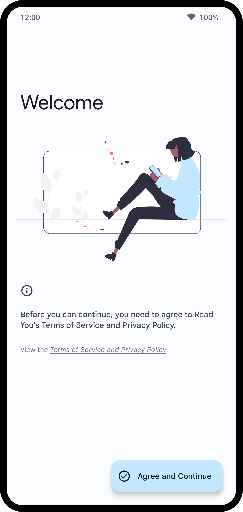
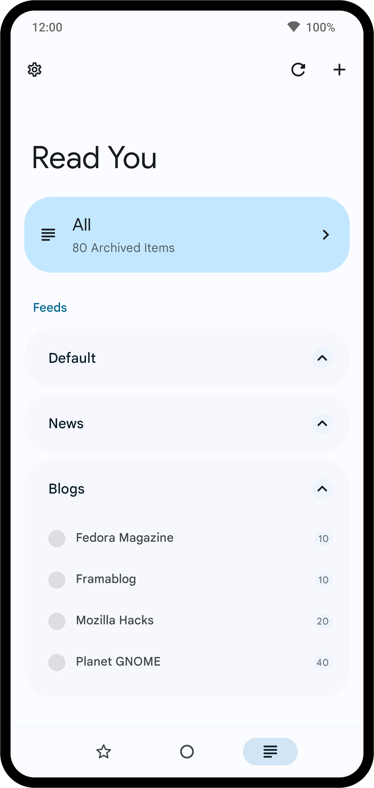
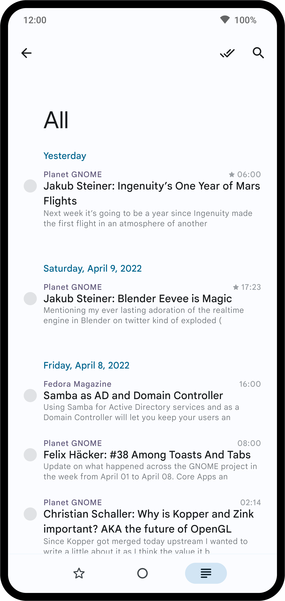
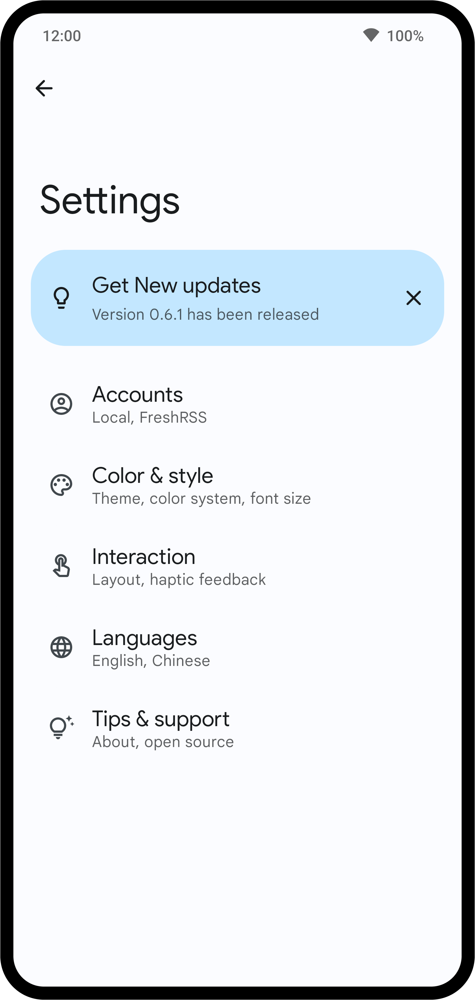

<div align="center">
    
</div>

<br>
<br>
<br>

<div align="center">
    <a href="LICENSE">
        
    </a>
    <a href="https://github.com/conice/LeafFeed/releases">
        
    </a>
    <a href="https://github.com/conice/LeafFeed/commits">
        
    </a>
</div>

<div align="center">
    <h1>LeafFeed</h1>
    <p>An open-source Android feed reader built with <a href="https://m3.material.io/">Material 3</a> and adaptive layouts.</p>
    <p>RSS reading, content organization, cross-device synchronization, and podcast playback in one app.</p>
    <br>
    <br>
    
    
    
    
    
    <br>
    <br>
</div>

> **Project note:** LeafFeed is a vibe-coded project, developed through intent-driven iteration with substantial AI assistance.

## Features

LeafFeed currently provides:

- [x] RSS and Atom subscriptions organized into groups
- [x] OPML subscription import and export
- [x] Scheduled background synchronization, with Wi-Fi-only, charging-only, and sync-on-start options
- [x] Unread, starred, read-later, and highlighted filters, plus search and bulk mark-as-read actions
- [x] RSS content reading, full-page content extraction, and adjustable reading styles
- [x] Tags, notes, saved searches, filtering rules, and highlighting rules
- [x] System text-to-speech support
- [x] Notifications for new articles and podcast episodes
- [x] Podcast playback, downloads, queues, sleep timers, and transcripts
- [x] Title and article summaries through a user-selected OpenAI-compatible service
- [x] Article-list and single-article home-screen widgets
- [x] Import and export for reading data, rules, and application preferences

## Integrations

In addition to local accounts that remain entirely on the device, LeafFeed can connect to the following synchronization services:

- [x] Fever
- [x] Google Reader API
- [x] FreshRSS
- [x] Feedly
- [x] Inoreader

Availability may depend on the server API, account permissions, and network environment.

## Download

<a href="https://github.com/conice/LeafFeed/releases">
    
</a>

LeafFeed supports Android 8.0 (API 26) and later. Packages from different distribution sources may use different signing certificates. Android cannot install one package directly over another when their certificates differ, so export important data before switching distributions.

## Data and Privacy

Subscriptions, articles, account information, and preferences are stored locally on the device. LeafFeed does not operate advertising or analytics services.

The following actions send the required data to external services:

- Retrieving feeds or full web content sends requests to the corresponding websites.
- Using a synchronized account communicates with the service selected or configured by the user.
- Using AI summaries sends the selected titles or article content directly to the OpenAI-compatible service configured by the user.

Review a third-party service's privacy policy before enabling it. Preference backups exclude API keys by default. If you choose to export API keys, they are written to the file as plain text and must be stored securely.

## Build

LeafFeed is a native Android application built with Kotlin, Jetpack Compose, and Material 3.

The build environment requires JDK 17 and Android SDK Platform 36. The repository includes the Gradle Wrapper, so a separate Gradle installation is not required. The first build requires network access to download build tools and dependencies.

1. Clone the repository and enter the project directory.

   ```bash
   git clone https://github.com/conice/LeafFeed.git
   cd LeafFeed
   ```

2. Open the project in the latest version of Android Studio and wait for Gradle synchronization to finish.

3. Select a device or an emulator running API 26 or later, then run the `githubDebug` variant. You can also build it from the command line:

   ```bash
   ./gradlew :app:assembleGithubDebug
   ```

The project defines three distribution flavors: `github`, `fdroid`, and `googlePlay`. Replace `Github` in a task name with `Fdroid` or `GooglePlay` to build the corresponding variant. The Google Play variant uses a separate application ID suffix.

### Testing

```bash
# JVM unit tests
./gradlew :app:testGithubDebugUnitTest

# Android Lint
./gradlew :app:lintGithubDebug

# Requires a connected device or emulator
./gradlew :app:connectedGithubDebugAndroidTest
```

### Release Signing

Release builds read the following properties from `signature/keystore_release.properties` or `signature/keystore.properties`:

```properties
storeFile=/path/to/keystore
storePassword=...
keyAlias=...
keyPassword=...
```

Do not commit keystores or real credentials to the repository.

## Project Structure

LeafFeed is currently a single-module Android application. Its source code is divided into three main layers:

```text
app/src/main/java/me/ash/reader/
|-- domain/          Domain models, database interfaces, synchronization, and business services
|-- infrastructure/ Room, networking, RSS, AI, audio, preferences, and dependency injection
`-- ui/              Compose screens, components, themes, adaptive navigation, and widgets
```

The main technologies include Jetpack Compose, Room, DataStore, Paging 3, WorkManager, Hilt, OkHttp, Retrofit, ROME, Readability4J, Coil, Media3, and Glance.

Additional engineering constraints are documented in:

- [`docs/architecture-roadmap.md`](docs/architecture-roadmap.md)
- [`docs/design-language.md`](docs/design-language.md)
- [`docs/performance.md`](docs/performance.md)

## Contributing

Use [Issues](https://github.com/conice/LeafFeed/issues) to report reproducible problems or propose features. [Pull requests](https://github.com/conice/LeafFeed/pulls) are also welcome.

Before submitting a change, run at least the unit tests and Lint checks for the affected variant. Database changes must include the corresponding updated Room schema in `app/schemas/`. Changes involving synchronization, reading, media, or navigation should also be checked against the relevant scenarios in the performance document.

New UI must cover loading, empty, offline, error, and populated states. It should also be checked in dark mode, with large text, in right-to-left layouts, and on expanded windows.

## License

GNU GPL v3.0 &copy; [LeafFeed](LICENSE)

## Upstream

LeafFeed is an open-source Android RSS reader. Thanks to the maintainers and contributors of the upstream project that provided the foundation on which this project is built.
