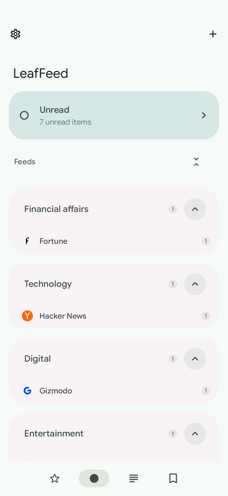
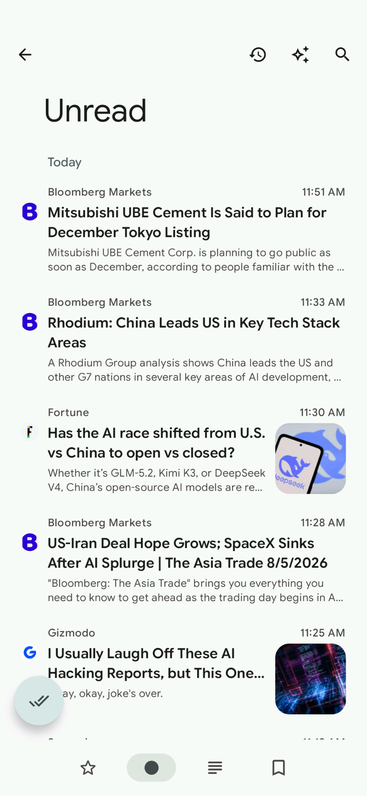
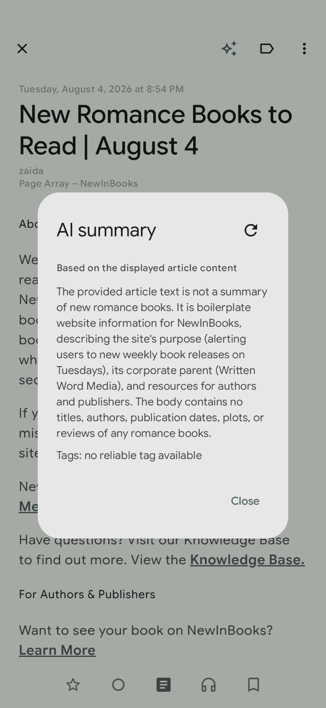
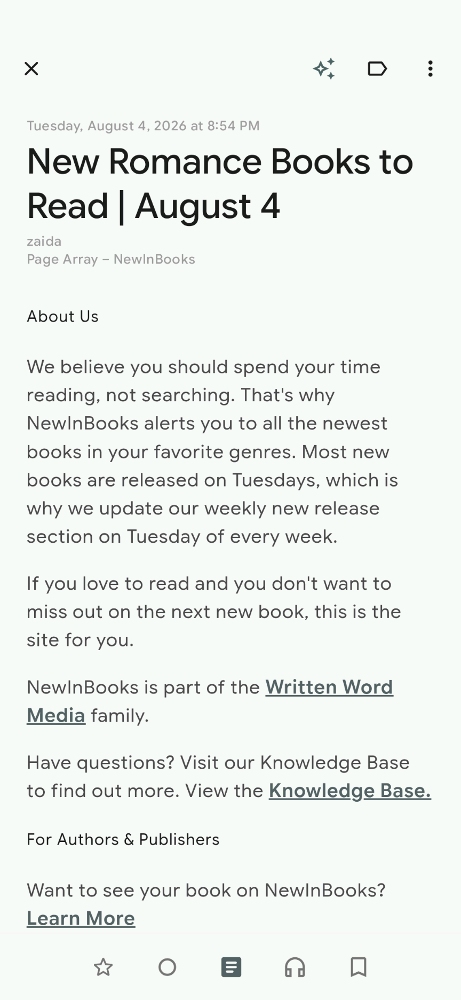
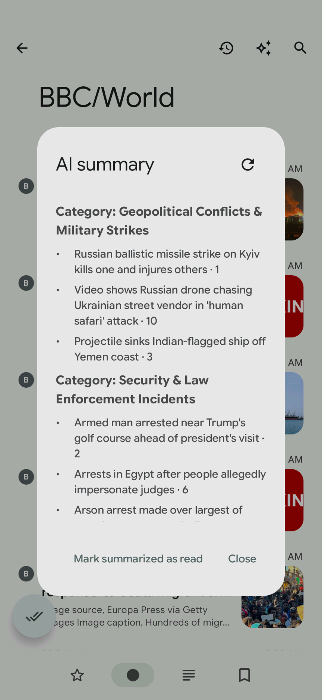
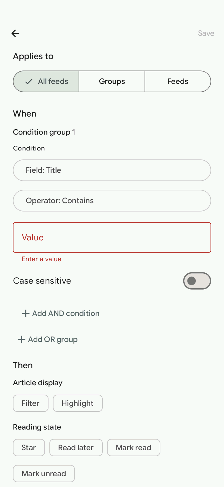
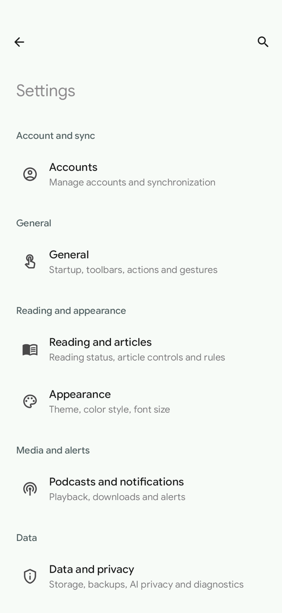

<div align="center">
  <a href="https://github.com/conice/LeafFeed">
    
  </a>

  <h3>LeafFeed</h3>
  <p>A private, modern RSS reader for Android</p>

  <p>
    <a href="https://github.com/conice/LeafFeed/stargazers"></a>
    <a href="https://github.com/conice/LeafFeed/graphs/contributors"></a>
    <a href="https://github.com/conice/LeafFeed/releases"></a>
    <a href="https://github.com/conice/LeafFeed/releases/latest"></a>
    <a href="LICENSE"></a>
    <br />
    
    
    
    <br />
    <br />
    
    &nbsp;&nbsp;
    
    &nbsp;&nbsp;
    
  </p>
</div>

LeafFeed is an Android RSS and podcast reader built around your subscriptions rather than an algorithm. Keep feeds, articles, playback progress, and settings on your device; connect only the sync and AI services you choose.

## Getting Started

LeafFeed is under active development. Feedback and bug reports are welcome in [GitHub Issues](https://github.com/conice/LeafFeed/issues).

| Platform | Requirement | Source |
| :--- | :--- | :--- |
| Android | Android 8.0 / API 26 or later | [](https://github.com/conice/LeafFeed/releases/latest) |
| Android | Latest CI test build | [](https://github.com/conice/LeafFeed/actions) |
| Source | Kotlin / Jetpack Compose | [](https://github.com/conice/LeafFeed) |

> [!IMPORTANT]
>
> Android only permits an APK to update an installed app when both use the same package name and signing certificate. To keep receiving in-place updates, always install builds from the same release channel. If a version signed with a different certificate is already installed, back up your data before uninstalling it.

Star the repository to keep track of new versions and release notes.

## What LeafFeed Does

### Follow What You Chose

Subscribe to RSS and Atom feeds, organize them into groups, and move through a clean unread timeline. Stars, Read Later, search, saved searches, tags, and OPML import make it easy to collect and return to the stories that matter. Use a local account or connect a compatible Fever or Google Reader service.

<p align="center">
  
  &nbsp;&nbsp;
  
</p>

### Read Comfortably

Open articles in a focused reader with full-content parsing and controls for typography, line height, alignment, images, and themes. Keep reading history, notes, excerpts, and text-to-speech close at hand.

<p align="center">
  
</p>

### Summarize on Your Terms

Use a configured OpenAI Responses, Google Gemini, or Anthropic service to turn a busy list of headlines into a categorized briefing or to summarize the article currently on screen. You can save multiple API connections and models, choose task-specific prompts and fallback models, and control request timeout, content scope, and whether links are included.

<p align="center">
  
  &nbsp;&nbsp;
  
</p>

### Listen to Podcasts

Play podcast feeds alongside your reading. Add episodes to a queue, download them for offline listening, resume from saved progress, tune playback speed and skip intervals, and open available transcripts. Playback works with Android media controls, including the lock screen, headset controls, and Android Auto.

<p align="center">
  
</p>

### Let Rules Do the Sorting

Create automation rules for all feeds, selected groups, or individual feeds. Match against titles, descriptions, authors, URLs, and media properties with text, numeric, or regular-expression conditions; then filter, highlight, star, save, or update an article's reading state.

<p align="center">
  
</p>

### Keep Control of Your Data

Tune startup behavior, toolbars, gestures, appearance, reading controls, podcast downloads, notifications, and privacy from one settings area. Export and import preferences, tags, notes, saved searches, reading state, and automations; subscriptions use OPML and rules use a dedicated backup format with integrity checks.

<p align="center">
  
</p>

## Contributing

Issues and pull requests are welcome. Changes should account for local accounts, third-party accounts, background synchronization, data migration, and the Android lifecycle.

<details>
  <summary><strong>Development and builds</strong></summary>

The development environment requires JDK 17, Android SDK with Compile SDK 36, and the Gradle Wrapper included in this repository.

```bash
# GitHub-channel debug APK
./gradlew assembleGithubDebug

# Unit tests and Android Lint
./gradlew testGithubDebugUnitTest lintGithubDebug
```

Release builds require a persistent signing certificate configured through these environment variables:

```text
LEAFFEED_SIGNING_STORE_FILE
LEAFFEED_SIGNING_STORE_PASSWORD
LEAFFEED_SIGNING_KEY_ALIAS
LEAFFEED_SIGNING_KEY_PASSWORD
```

For local builds, the same properties can be kept in the user's Gradle properties file instead of
the repository. On Termux this is `/data/data/com.termux/files/home/.gradle/gradle.properties`.
Gradle user properties are loaded automatically and are used when the corresponding environment
variable is not set. The file may use either the `LEAFFEED_SIGNING_*` names above or the shorter
`storeFile`, `storePassword`, `keyAlias`, and `keyPassword` names.

```bash
./gradlew assembleGithubRelease
```

Never commit keystores, passwords, API keys, or backups containing sensitive information.

</details>

## Code Signing Policy

GitHub Release APKs are signed with a persistent certificate held by the project maintainer. The keystore and passwords are supplied to GitHub Actions through Repository Secrets and are never stored in the repository. The workflow validates the keystore, alias, and credentials before packaging.

Anyone producing an independent build is responsible for signing it and safeguarding the certificate. APKs signed with different certificates cannot update one another, even when their package names and versions are identical.

## Privacy

LeafFeed contains no advertising or built-in analytics service. Accounts, subscriptions, articles, and preferences are stored locally by default.

- Android system backup is disabled because account credentials are protected by a device-local encryption key. Use LeafFeed's explicit export tools for subscriptions and settings when moving devices, then enter account credentials again.
- When synchronization is enabled, subscription and reading-state data is sent to the service configured by the user.
- When an AI feature is used, selected headlines or article content is sent directly to the configured AI provider and endpoint.
- Background synchronization, notifications, and podcast playback may use the network, wake locks, and foreground services.
- Users should review the privacy policies of their content sources, synchronization services, and AI providers.

## License

LeafFeed is distributed under the [GNU General Public License v3.0](LICENSE). Distributions of modified versions must comply with the source-availability and license-preservation requirements of GPL-3.0. Third-party components and assets remain subject to their respective licenses.

## Upstream Acknowledgement

LeafFeed is a derivative project based on [Read You](https://github.com/Ashinch/ReadYou). We thank Read You author Ashinch and every upstream contributor for the design, code, and open-source foundation on which this project builds.

LeafFeed is not an official Read You release and is not affiliated with or endorsed by the upstream project or its maintainers. Issues caused by LeafFeed-specific features or modifications should be reported to [LeafFeed Issues](https://github.com/conice/LeafFeed/issues); upstream maintainers should not be expected to support this fork. Copyright in the original code and subsequent modifications remains with the respective contributors, and the project continues to be distributed under GPL-3.0.
